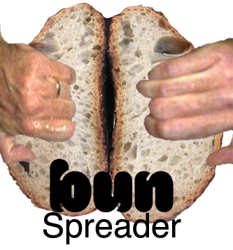

# ALL TESTS ARE RAN ON A SINGLE CORE CLOUD INSTANCE
Yes.  No advantage given to rust, but it should be stated that vertical scaling
is WAY easier in rust than js.

### Bun Spreader
The ultimate bun spreading performance testings.

